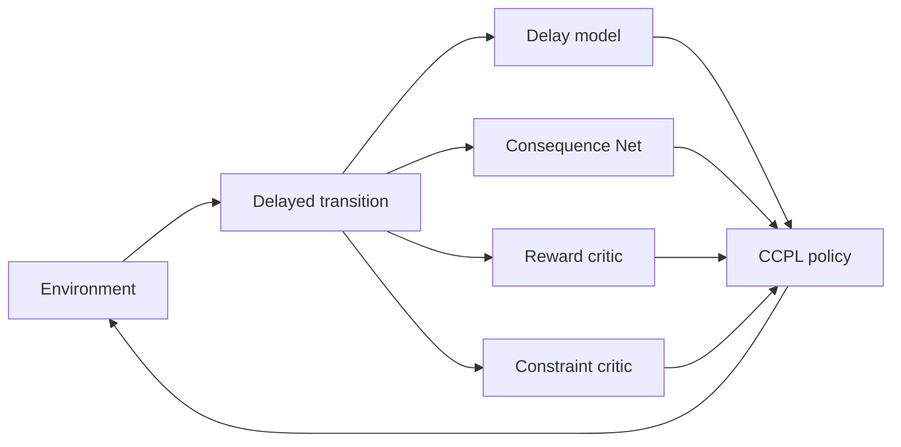
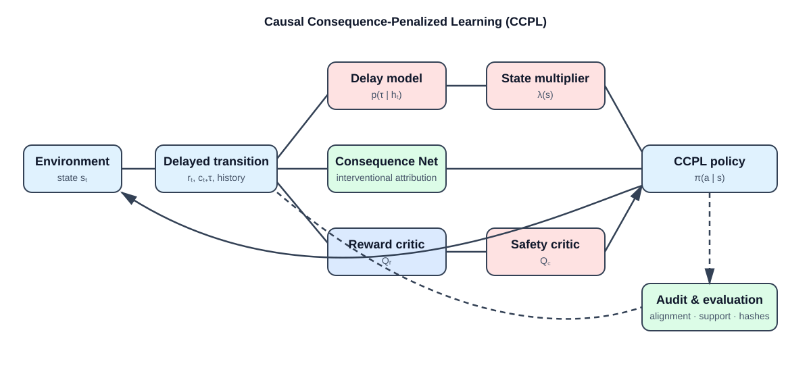

# CCPL

## Causal Consequence-Penalized Learning

CCPL is a research implementation of constrained reinforcement learning for
systems where an action can cause a safety consequence later. It addresses a
failure mode of ordinary safety RL: assigning a delayed violation to the most
recent action can train the policy to blame the wrong decision. CCPL makes the
delay explicit, separates reward from safety learning, and preserves the
information needed to attribute consequences to actions.

The project delivers an executable research artifact, not only an algorithmic
description. It includes tested Python components, delayed-cost environments,
causal consequence utilities, offline audit/evaluation workflows, reproducible
experiment protocols, and MATLAB robotics demonstrations. Together, these
pieces turn delayed-safety ideas into inspectable experiments that can be
reproduced, stress-tested, and adapted to robotics or logged industrial data.

## What CCPL solves

CCPL is designed to solve four practical problems in constrained RL:

1. **Delayed credit assignment:** safety costs are aligned with their delayed
   source instead of being attached blindly to the latest action.
2. **Safety objective interference:** reward and constraint critics use separate
   targets, so safety tuning does not silently rewrite the reward objective.
3. **Action-level consequence reasoning:** interventional consequence labels and
   the Consequence Net expose which actions are responsible for risk.
4. **Deployment evidence gaps:** audit schemas, support checks, hashes, seed
   records, and offline evaluation reports make safety experiments traceable.

The useful outcome is a controller-development workflow that can answer not
only “did reward improve?” but also “which actions caused risk, when did the
risk become visible, and does the policy remain within the stated constraint?”

The method has four implementation components:

1. **Delay-corrected Bellman targets.** A delay model produces a state-
   dependent effective discount factor instead of assigning every observed
   cost to the most recent action.
2. **State-conditioned multipliers.** The constrained policy uses a multiplier
$\lambda(s)$ rather than one scalar penalty for all states.
3. **Interventional consequence attribution.** The Consequence Net estimates
   action-level contribution from interventional labels supplied by a
   controlled structural causal model (SCM).
4. **Separate critics.** Reward and constraint value functions have separate
parameters and TD targets, so changing $\lambda$ does not change either
   critic's target.

CCPL is research software. The theoretical statements are conditional: the
contraction result requires its stated assumptions, including a positive
minimum delay, and the state-conditioned multiplier result does not claim
universal dominance over a scalar multiplier. Synthetic SCM experiments
evaluate agreement with programmed structural equations; they do not identify
causality from observational data.

These boundaries are deliberate. CCPL provides a stronger basis for
delayed-safety experimentation and diagnosis; it is not, by itself, a safety
certificate, a causal-identification procedure for arbitrary logs, or permission
to deploy an unvalidated policy on physical equipment.

### Implementation flow



Rendered version for GitHub and web viewers:



### TikZ architecture source

For papers, reports, and LaTeX documentation, the same architecture is
available as a TikZ figure. The diagram makes the central contribution
explicit: delayed safety information is modeled and attributed before it
changes the policy.

```latex
\usepackage{tikz}
\usetikzlibrary{positioning}

\begin{tikzpicture}[
  node distance=11mm and 13mm,
  box/.style={draw, rounded corners, align=center, minimum width=28mm,
              minimum height=9mm, fill=blue!7},
  safety/.style={box, fill=red!8},
  data/.style={box, fill=green!8},
  arrow/.style={->, thick, >=stealth}
]
\node[box] (env) {Environment\\$s_t$};
\node[box, right=of env] (transition) {Delayed transition\\$(s_t,a_t,r_t,c_{t+\tau})$};
\node[safety, above right=of transition] (delay) {Delay model\\$p(\tau\mid h_t)$};
\node[data, below right=of transition] (consequence) {Consequence Net\\interventional attribution};
\node[box, right=28mm of transition] (reward) {Reward critic\\$Q_r$};
\node[safety, right=of consequence] (constraint) {Safety critic\\$Q_c$};
\node[safety, right=of delay] (multiplier) {State multiplier\\$\lambda(s)$};
\node[box, right=28mm of reward] (policy) {CCPL policy\\$\pi(a\mid s)$};
\node[data, below=of policy] (audit) {Audit and evaluation\\alignment, support, hashes};

\draw[arrow] (env) -- node[above] {$a_t$} (transition);
\draw[arrow] (transition) -- (delay);
\draw[arrow] (transition) -- (consequence);
\draw[arrow] (transition) -- (reward);
\draw[arrow] (transition) -- (constraint);
\draw[arrow] (delay) -- (multiplier);
\draw[arrow] (reward) -- (policy);
\draw[arrow] (constraint) -- (policy);
\draw[arrow] (multiplier) -- (policy);
\draw[arrow] (consequence) -- (policy);
\draw[arrow] (policy) |- node[pos=.25, right] {$a_t$} (env);
\draw[arrow, dashed] (transition) |- (audit);
\draw[arrow, dashed] (policy) -- (audit);
\end{tikzpicture}
```

## Installation

The PyPI distribution is `ccpl-rl`; the Python import namespace is `ccpl`.

```bash
python -m pip install ccpl-rl
```

For development:

```bash
git clone https://github.com/sciencebanda09/ccpl.git
cd ccpl
python -m pip install -e ".[dev]"
python -m pytest -q
```

## Public API

CCPL currently supports discrete actions and NumPy observations. A minimal
Gymnasium integration is:

```python
import gymnasium as gym
from ccpl import GymnasiumCCPLEnv, make_ccpl

gym_env = gym.make("CartPole-v1")

wrapped_env = GymnasiumCCPLEnv(
    gym_env,
    consequence_key="cost",
    consequence_delay=2,
)
agent = make_ccpl(
    state_dim=gym_env.observation_space.shape[0],
    action_dim=gym_env.action_space.n,
    constraint_d=10.0,
    seed=42,
)

agent.fit(wrapped_env, episodes=1_000)
observation = wrapped_env.reset()
action = agent.predict(observation)
agent.save("checkpoints/ccpl.pkl")
```

The adapter reads the safety cost from `info["cost"]`. The environment must
expose a discrete action space. Pickle checkpoints must only be loaded from
trusted sources.

`SafetyPolicy` can add application-specific action validation, a fallback
action, a consequence budget, and JSONL audit logging. This is a runtime
control and audit mechanism; it is not a safety certificate.

## Logged delayed-consequence data

For a real-data audit, use the SWaT/WADI adapter with local CSV exports:

```powershell
python scripts/evaluate_real_data.py data/swat/sensor.csv `
  --actuator-file data/swat/actuator.csv `
  --split test `
  --output results/swat_wadi_audit.json
```

To estimate the value of a compatible CCPL checkpoint with fitted-Q
evaluation, add:

```powershell
python scripts/evaluate_real_data.py data/swat/sensor.csv `
  --actuator-file data/swat/actuator.csv `
  --checkpoint results/ccpl_swat.pkl `
  --split test `
  --output results/swat_ccpl_fqe.json
```

The FQE report includes bootstrap intervals, policy action coverage, and
minimum logged-action support. It is a model-based offline estimate, not a
causal identification result or an online safety guarantee.

The report includes dataset summaries, input hashes, observed delay alignment,
and a latest-visible-action diagnostic. It does not report counterfactual CCPL
performance from logs alone. That requires a separately specified offline
policy-evaluation model. Anomaly labels are consequences; they are not causal
source labels unless the source timestep is explicitly present in the data.

For real logged trajectories, CCPL provides a strict JSONL contract and an
audit utility. Each record contains an episode identifier, contiguous timestep,
state vector, action, reward, consequence, timestamp, and terminal flag. Delay
and source-action fields are optional because many observational logs do not
identify causal responsibility. Causal labels must only be included when they
come from a justified intervention or validated causal model.

```bash
python scripts/audit_logged_dataset.py data/trajectories.jsonl \
  --output results/real_delay_audit.json
```

See [`docs/REAL_DELAY_PROTOCOL.md`](docs/REAL_DELAY_PROTOCOL.md) for the
schema, validation rules, and the staged offline evaluation protocol. The
validator prepares real-data experiments; it does not by itself establish
causal identification or safe deployment.

For an audited offline estimate on a converted logged dataset, run:

```bash
python scripts/run_real_benchmark.py data/trajectories.jsonl \
  --policy CCPL=checkpoints/ccpl.pkl \
  --output results/real_benchmark.json
```

The benchmark records dataset and checkpoint hashes, action support, fitted-Q
estimates, and bootstrap intervals. It does not claim counterfactual causal
effects or replace online safety validation.

To create reproducible offline checkpoints for a logged dataset, fit all six
policy-labelled behavior-cloning surrogates on the training episodes:

```bash
python scripts/train_offline_policies.py data/trifinger/eval0906_9994.jsonl \
  --output-dir checkpoints/trifinger_bc --seed 42
```

Evaluate only held-out episodes with repeated `--policy NAME=PATH` arguments.
These checkpoints are offline behavior-cloning baselines, not claims that the
online PPO, SAC-Lag, CPO-FO, or CCPL optimizers were reproduced offline.

## Mathematical specification

Let $p(\tau\mid h)$ be a delay distribution over
$\tau\in\{0,\ldots,K\}$, conditional on history $h$. CCPL uses

$$
\gamma_{\mathrm{eff}}(h)
  = \sum_{\tau=0}^{K} p(\tau\mid h)\gamma^{\tau}.
$$

Therefore $\gamma^K\leq\gamma_{\mathrm{eff}}(h)\leq 1$. A contraction
modulus strictly below one does not follow from an arbitrary unknown delay
distribution: an assumption excluding zero delay, or an equivalent bound, is
required. The complete scope and assumptions are in
[`docs/MATHEMATICAL_SPEC.md`](docs/MATHEMATICAL_SPEC.md).

## Experiments and results

The repository distinguishes three kinds of evidence:

- **Paper-reported benchmark results:** results from the protocol and version
  stated in the associated paper.
- **Repository reproductions:** outputs produced from a tagged source version,
  recorded configuration, dependency versions, and explicit seed list.
- **Preliminary experiments:** smoke tests or reduced runs, including short
  Safety Gymnasium evaluations. These verify execution and are not benchmark
  evidence.

The E8 experiment compares CCPL with CCPL-Base, CPO-FO, PPO, and SAC-Lag on
selected Safety Gymnasium tasks. It writes reward, constraint-satisfaction,
reward-versus-cost, and learning-curve figures:

```bash
python -m pip install -e ".[dev]"
python -m pip install "gymnasium==0.28.1" "mujoco==2.3.3" \
  "pygame>=2.6.1" "xmltodict" "pyyaml" "imageio"
python -m pip install --no-deps "safety-gymnasium==1.0.0"

export MUJOCO_GL=egl
export MPLBACKEND=Agg
python ccpl_experiments.py --exp E8 \
  --tasks SafetyPointGoal1 \
  --episodes 500 --eval-episodes 100 --seeds 3 \
  --out results_mujoco
```

## MATLAB robotics demonstrations

The repository also contains standalone MATLAB demonstrations that do not
import the Python package. They connect delayed-safety ideas to robot
kinematics and Simscape workflows:

- `ccpl_kinova_ccpl_demo.m` runs continuous Kinova Gen3 reaching with live
  visualization, delayed safety costs, deterministic evaluation, and saved
  trajectories.
- `ccpl_atlas_balance_ccpl_demo.m` demonstrates whole-body ATLAS balance using
  center-of-mass and support-foot metrics.
- `ccpl_atlas_physical_walker.m` validates ATLAS inertial properties, imports
  the model into Simscape Multibody, enables torque actuation, and prepares
  physical foot-contact wiring.

These files make the research ideas easier to inspect in a browser-based
robotics environment. The Kinova and ATLAS balance files are simulation demos;
the ATLAS Simscape launcher only reports validated walking after physical
torque, contact, torso-sensing, and fall-detection interfaces are connected.
They are not claims of safe physical-robot deployment.

`CPO-FO` is the repository's first-order constrained policy-optimization
baseline. It is not an exact conjugate-gradient or natural-gradient
implementation of CPO. See [`docs/CPO_COMPARISON.md`](docs/CPO_COMPARISON.md).

## Repository layout

```text
ccpl/                 Installable Python package
  algorithms/         CCPL, baselines, networks, and theory utilities
  environments/       Synthetic environments and Gymnasium adapters
configs/              Versioned experiment configurations
docs/                 Mathematical and research protocols
scripts/              Convenience entry points
tests/                Numerical, theoretical, and regression tests
ccpl_experiments.py   Synthetic and external-environment experiments
run_benchmark_v7.py   Primary synthetic benchmark runner
```

## Reproducibility

The full theorem statements and derivations are in
[docs/THEOREMS_AND_DERIVATIONS.md](docs/THEOREMS_AND_DERIVATIONS.md).

Read [`REPRODUCIBILITY.md`](REPRODUCIBILITY.md), [`DATA_SPEC.md`](DATA_SPEC.md),
[`docs/RESEARCH_PROTOCOL.md`](docs/RESEARCH_PROTOCOL.md), and
[`docs/DATA_AND_ARTIFACTS.md`](docs/DATA_AND_ARTIFACTS.md). Every reported
result should include the exact command, configuration, source revision,
dependency versions, environment name, and individual seed values.

The strongest contribution of this repository is reproducible evidence around
delayed safety: tests establish accounting and alignment behavior, benchmark
commands establish comparative performance, and audit artifacts preserve the
conditions under which a result was produced. Use the MATLAB demos as
self-contained extensions of that workflow, with toolbox versions and generated
model files recorded alongside the results.

## Tests

```bash
python -m pytest -q
```

The last verified run contains **44 passed, 0 failed, and 0 skipped** tests.

## Citation

If you use CCPL in academic or research work, cite the associated paper.
Citation metadata is maintained in [`CITATION.cff`](CITATION.cff). Bibliographic
fields not present in this repository are intentionally not guessed.

## License

CCPL is source-available research software with separate commercial
licensing. Academic, educational, and non-commercial research users may
inspect, run, modify, and use it for experiments and publications, provided
they retain the copyright and license notices and cite the CCPL paper.
Production deployment, commercial products or services, SaaS/API offerings,
proprietary integrations, paid services based substantially on CCPL, and
commercial redistribution require a separate commercial license. See
[`LICENSE`](LICENSE). This is not an OSI-approved open-source license.

## GitHub metadata

Suggested description:

> Causal RL for safety constraints under delayed consequences, combining delay-corrected Bellman targets, causal consequence attribution, state-conditioned Lagrange multipliers, and dual Q-functions.

Suggested topics: `reinforcement-learning`, `safe-reinforcement-learning`,
`constrained-reinforcement-learning`, `causal-reinforcement-learning`,
`causal-inference`, `deep-reinforcement-learning`, `machine-learning`,
`artificial-intelligence`, `neurips`, `research`.
